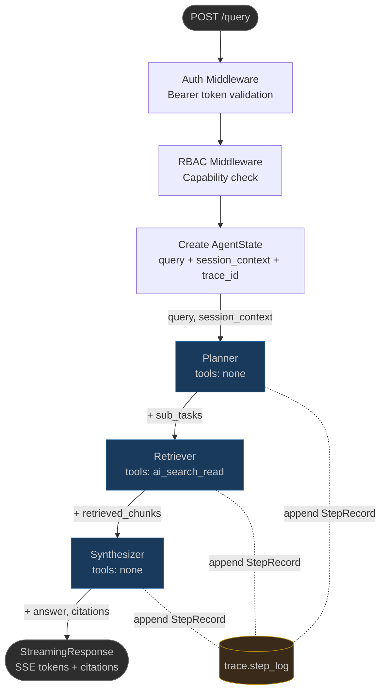
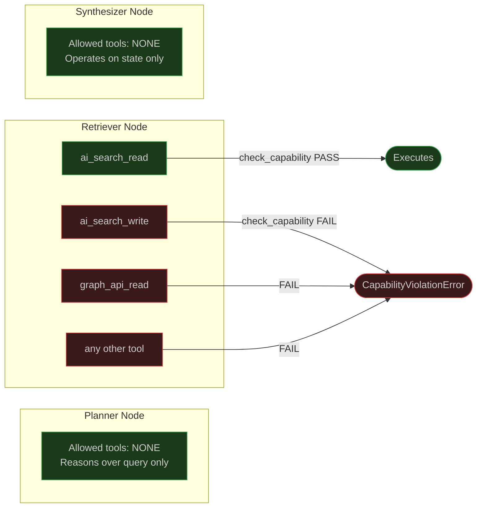
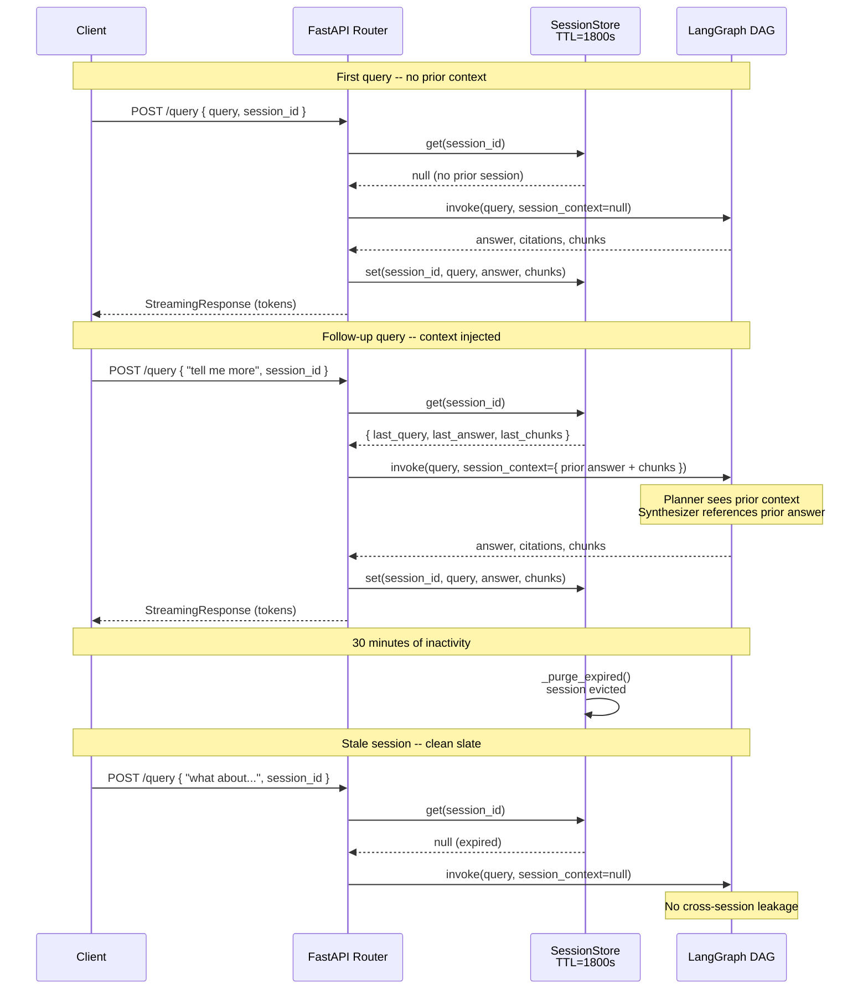

# Interview Walkthrough: Multi-Agent Workflow Design

> Prompt: "Walk me through a multi-agent workflow you designed end to end.
> I want to understand the actual design decisions -- why you structured it
> the way you did, what you considered and rejected, and where you had to
> solve something that didn't work the first time."

---

## The DAG: Planner -> Retriever -> Synthesizer

It's a three-node LangGraph DAG. Linear right now -- no conditional branching.
That's intentional. I considered a more complex topology early on (retriever
loops back to planner if confidence is low, synthesizer can re-query), but I
rejected it for v1. Here's why:

**The federal compliance constraint changes everything.** When your system needs
NIST AU-2 audit trail compliance and deterministic re-playability, every
conditional edge is a combinatorial explosion for testing. A linear DAG means
given the same input and pinned prompts, I get the same trace. Every time.
That's not optional for GCCH.

I'll add conditional edges in v2 -- specifically a confidence-gated retry loop
from Synthesizer back to Retriever -- but only after the eval harness proves
the linear path meets the acceptance bar first.

---

## State Ownership -- The Decision That Shaped Everything

Before I wrote a single node, I locked the `AgentState` schema. Every field
has exactly one owner:

| Field              | Owner        | Purpose                          |
|--------------------|--------------|----------------------------------|
| `sub_tasks`        | Planner      | Decomposed retrieval subtasks    |
| `retrieved_chunks` | Retriever    | Chunks from AI Search            |
| `answer`           | Synthesizer  | Final response                   |
| `citations`        | Synthesizer  | Source attribution                |
| `trace.step_log`   | All (append) | Audit trail -- append-only       |

No node touches another node's fields. Period. I considered a shared scratchpad
pattern (like AutoGen uses) and rejected it -- shared mutable state between
agents is how you get nondeterministic behavior that's impossible to audit.

---

## Capability Sandboxing -- Not Policy, Code

This is the design decision I'm most deliberate about. Every node has a tool
manifest:

| Node        | Allowed Tools        | Rationale                     |
|-------------|----------------------|-------------------------------|
| Planner     | `[]`                 | Reasons over query, no I/O    |
| Retriever   | `["ai_search_read"]` | Read-only, one tool           |
| Synthesizer | `[]`                 | Operates on state only        |

Before any tool call, `check_capability()` runs against the manifest. If the
Retriever tries to call `ai_search_write` or anything outside its manifest, it
raises `CapabilityViolationError` immediately. Not logged as a warning. Not
silently dropped. An exception.

I chose this over a permission-based approach (where you grant permissions)
because the default-deny posture is what federal reviewers want to see. The
question isn't "what can this agent do?" -- it's "prove this agent *can't* do
anything else."

The sandbox tests have zero tolerance. 100% pass required. One failure blocks
the release.

---

## What Didn't Work the First Time: Follow-Up Context

This is where Meridian taught me a lesson. In Meridian's eval, the query
"Can you give me an example?" had a **54% false refusal rate**. Why? Because
the follow-up chip fired a standalone RAG query with zero prior context. The
system had no idea what "that" referred to.

So in aiPolaris, I built session memory from day one --
`InMemorySessionStore` with 30-minute TTL, keyed by `session_id`. The prior
answer and chunks get injected into `AgentState.session_context` on the next
query. Follow-up pass rate went from 0/4 to 4/4.

The TTL prevents cross-session leakage -- after 30 minutes of inactivity, the
session is purged. No user's context bleeds into another user's session. That's
not just good engineering, it's a compliance requirement.

---

## What Didn't Work the First Time: Chunking

Meridian had a 59% refusal rate on technical queries. I traced it to coarse
chunking -- averaging 2 chunks per article. The retriever was returning
fragments that didn't contain enough context for the synthesizer to answer
confidently.

ADR-005 in aiPolaris specifies overlapping window chunking: 512-token target,
10% overlap, min 100, max 600. The overlap eliminates boundary artifacts where
an answer spans two chunks. I didn't invent this -- it's well-established --
but I made it an ADR because changing the chunking strategy changes the eval
baseline, and that requires a documented decision.

---

## Streaming -- Solving the Demo Problem

Non-streaming queries showed a blank screen for 9+ seconds at p95. The actual
latency doesn't change with streaming, but **perceived** latency drops to under
a second for the first token. I implemented it as FastAPI `StreamingResponse`
with SSE, chunking the answer into 20-token segments.

This matters because live demos are how federal contracts move forward. A
9-second blank screen kills the room. First token in under a second keeps
attention.

---

## The Eval Harness -- How I Know It Works

20 golden questions across 5 categories:

| Category          | Questions | Purpose                              |
|-------------------|-----------|--------------------------------------|
| Direct factual    | q001-q006 | Basic RAG quality                    |
| Multi-step        | q007-q010 | Planner decomposition quality        |
| Correct refusal   | q011-q014 | Out-of-scope rejection               |
| Gap detection     | q015-q016 | Chunking/indexing diagnostics        |
| Follow-up context | q017-q020 | Session memory effectiveness         |

The eval doesn't just check if the answer is right -- it checks refusal
correctness, confidence calibration, latency percentiles, and replay
determinism.

**Acceptance bar:**

| Metric                 | Threshold    |
|------------------------|--------------|
| p95 latency            | < 4,000 ms   |
| p50 latency            | < 1,500 ms   |
| Avg confidence         | > 0.75       |
| Correct refusal rate   | 100%         |
| Incorrect refusal rate | < 10%        |
| Follow-up pass rate    | 4/4 (100%)   |
| Sandbox tests          | 100% pass    |
| Replay match rate      | >= 95%       |

Current state with no data indexed: 100% refusal rate, 20% correct refusal
(only the out-of-scope questions), 80% incorrect refusal. That's expected. The
eval harness is there so that when I wire up the real AI Search index, I can
measure the delta between runs. **The delta is the proof.**

---

## GCCH -- One Variable, Zero Code Changes

Every Azure endpoint is parameterized through Terraform workspaces. Commercial
uses `graph.microsoft.com`, GCCH uses `graph.microsoft.us`. Switching is
`terraform workspace select gcch && terraform apply`. The app code never sees a
hardcoded endpoint -- it reads from config populated by Terraform outputs.

I've seen teams maintain two codebases for commercial and GCCH. That's how you
get drift. One codebase, one variable.

---

## Key Source Files

| File                           | Purpose                                |
|--------------------------------|----------------------------------------|
| `agent/state.py`              | AgentState, TraceContext, StepRecord    |
| `agent/graph.py`              | LangGraph DAG wiring                   |
| `agent/nodes/planner.py`      | Planner node                           |
| `agent/nodes/retriever.py`    | Retriever node + capability check      |
| `agent/nodes/synthesizer.py`  | Synthesizer node + refusal logic       |
| `agent/tools/manifests.py`    | Tool manifests + CapabilityViolation   |
| `agent/memory/session.py`     | InMemorySessionStore (TTL=1800s)       |
| `api/routers/query.py`        | StreamingResponse + session integration|
| `api/config.py`               | Settings from Terraform outputs        |
| `eval/run_eval.py`            | Eval harness (20 golden questions)     |

---

*The architecture isn't complex -- it's deliberately simple. The complexity
is in the constraints it enforces.*
